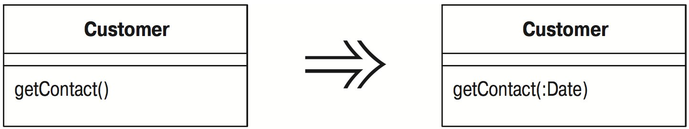

# Добавление параметра (Add Parameter)

Метод нуждается в дополнительной информации от вызывающего.

_Добавьте параметр, который может передать эту информацию._

## Мотивировка

«Добавление параметра» ([Add Parameter](Add-Parameter.md)) является очень распространенным рефакторингом, и вы наверняка уже производили его. Его мотивировка проста. Необходимо изменить метод, и изменение требует информации, которая ранее не передавалась, поэтому вы добавляете параметр.

В действительности, я хочу поговорить о том, когда не следует проводить данный рефакторинг. Часто есть альтернативы добавлению параметра, которые предпочтительнее, поскольку не приводят к увеличению списка параметров. Длинные списки параметров дурно пахнут, потому что их трудно запоминать и они часто содержат группы данных.

Взгляните на уже имеющиеся параметры. Можете ли вы запросить у одного из этих объектов необходимую информацию? Если нет, не будет ли разумно создать в них метод, предоставляющий эту информацию? Для чего используется эта информация? Не лучше ли было бы иметь это поведение в другом объекте – том, у которого есть эта информация? Посмотрите на имеющиеся параметры и представьте их себе вместе с новым параметром. Не лучше ли будет провести «Введение граничного объекта» ([Introduce Parameter Object](Introduce-Parameter-Object.md))?

Я не утверждаю, что параметры не надо добавлять ни при каких обстоятельствах; я часто делаю это, но не следует забывать об альтернативах.

## Техника

Механика «Добавления параметра» ([Add Parameter](Add-Parameter.md)) очень похожа на «Переименование метода» ([Rename Method](Rename-Method.md)).

* Выясните, где реализуется сигнатура метода – в родительском классе или подклассе. Выполните эти шаги для каждой из реализаций.
* Объявите новый метод с добавленным параметром. Скопируйте тело старого метода в метод с новым именем и осуществите необходимую подгонку.

_Если требуется добавить несколько параметров, проще сделать это сразу._

* Выполните компиляцию.
* Измените тело прежнего метода так, чтобы в нем вызывался новый метод.

_Если ссылок на метод немного, вполне можно пропустить этот шаг._

_В качестве значения параметра можно передать любое значение, но обычно используется `null` для параметра объекта и явно необычное значение для встроенных типов. Часто полезно использовать числа, отличные от нуля, чтобы быстрее обнаружить этот случай._

* Выполните компиляцию и тестирование.
* Найдите все ссылки на прежний метод и замените их ссылками на новый. Выполняйте компиляцию и тестирование после каждой замены.
* Удалите старый метод.

_Если старый метод является частью интерфейса и его нельзя удалить, сохраните его и пометьте как устаревший._

* Выполните компиляцию и тестирование.