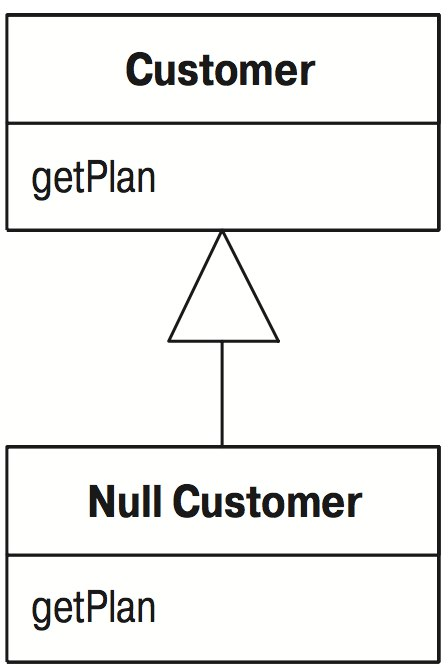

# Введение объекта Null (Introduce Null Object)

Есть многократные проверки совпадения значения с `null`.

_Замените значение `null` объектом `null`._

```java
if (customer == null) plan = BillingPlan.basic();
else plan = customer.getPlan();
```




## Мотивировка

Сущность полиморфизма в том, что вместо того, чтобы спрашивать у объекта его тип и вызывать то или иное поведение в зависимости от ответа, вы просто вызываете поведение. Объект, в зависимости от своего типа, делает то, что нужно. Все это не так прозрачно, когда значением поля является `null`. Пусть об этом расскажет Рон Джеффриз:

_Рон Джеффриз_

Мы впервые стали применять паттерн нулевого объекта, когда Рич Гарзанити (Rich Garzaniti) обнаружил, что код системы часто проверяет, существует ли объект, прежде чем послать ему сообщение. Мы запрашивали у объекта его метод person, а затем сравнивали результат с null. Если объект присутствовал, мы запрашивали у него метод rate. Это делалось в нескольких местах, и повторение кода в них стало нас раздражать.

Поэтому мы создали объект отсутствующего лица, который сообщал, что у него нулевой rate (мы называем наши null объекты отсутствующими объектами). Вскоре у отсутствующего лица было уже много методов, например rate. Сейчас у нас больше 80 классов нулевых объектов.

Чаще всего мы применяем нулевые объекты при выводе информации. Например, когда выводится информация о лице, то у соответствующего объекта может отсутствовать любой из примерно 20 атрибутов. Если бы они могли принимать значение null, вывод информации о лице стал бы очень сложным. Вместо этого мы подключаем различные нулевые объекты, которые умеют отображать себя правильным образом. В результате мы избавились от большого объема процедурного кода.

Наиболее остроумно мы применяем нулевой объект для отсутствующего сеанса Gemstone. Мы пользуемся базой данных Gemstone для готового кода, но разработку предпочитаем вести без нее и сбрасываем новый код в Gemstone примерно раз в неделю. В коде есть несколько мест, где необходимо регистрироваться в сеансе Gemstone. При работе без Gemstone мы просто подключаем отсутствующий сеанс Gemstone. Он выглядит так же, как реальный, но позволяет вести разработку и тестирование, не ощущая отсутствия базы данных.

Другое полезное применение нулевого объекта – для отсутствующего буфера. Буфер представляет собой коллекцию значений из платежной ведомости, которые приходится часто суммировать или обходить в цикле. Если какого то буфера не существует, возвращается отсутствующий буфер, который действует так же, как пустой буфер. Отсутствующий буфер знает, что у него нулевое сальдо и нет значений. При таком подходе удается избежать создания десятков пустых буферов для каждого из тысяч наших служащих.

Интересная особенность применения нулевых объектов состоит в том, что почти никогда не возникают аварийные ситуации. Поскольку нулевой объект отвечает на те же сообщения, что и реальный объект, система в целом ведет себя обычным образом. Из за этого иногда трудно заметить или локализовать проблему, потому что все работает нормально. Конечно, начав изучение объектов, вы где нибудь обнаружите нулевой объект, которого там быть не должно.

Помните, что нулевые объекты постоянны – в них никогда ничего не меняется. Соответственно, мы реализуем их по паттерну «Одиночка» (Singleton pattern) [Gang of Four]. Например, при каждом запросе отсутствующего лица вы будете получать один и тот же экземпляр этого класса.

Подробнее о паттерне нулевого объекта можно прочесть у Вулфа [Woolf].

## Техника

* Создайте подкласс исходного класса, который будет выступать как нулевая версия класса. Создайте операцию `isNull` в исходном классе и нулевом классе. В исходном классе она должна возвращать `false`, а в нулевом классе – `true`.

_Удобным может оказаться создание явного нулевого интерфейса для метода `isNull`._

_Альтернативой может быть использование проверочного интерфейса для проверки на `null`._

* Выполните компиляцию.
* Найдите все места, где при запросе исходного объекта может возвращаться `null`, и отредактируйте их так, чтобы вместо этого возвращался нулевой объект.
* Найдите все места, где переменная типа исходного класса сравнивается с `null`, и поместите в них вызов `isNull`.

_Это можно сделать, заменяя поочередно каждый исходный класс вместе с его клиентами и выполняя компиляцию и тестирование после каждой замены._

_Может оказаться полезным поместить нескольком утверждений assert, проверяющих на `null`, в тех местах, где значение `null` теперь не должно встречаться._

* Выполните компиляцию и тестирование.
* Найдите случаи вызова клиентами операции `if not null` и осуществления альтернативного поведения `if null`.
* Для каждого из этих случаев замените операции в нулевом классе альтернативным поведением.
* Удалите проверку условия там, где используется перегруженное поведение, выполните компиляцию и тестирование.

## Пример

Коммунальное предприятие знает свои участки: дома и квартиры, пользующиеся его услугами. У участка всегда есть пользователь (customer).

```java
class Site...
    Customer getCustomer() {
        return _customer;
    }
    
    Customer _customer;

/// У пользователя есть несколько характеристик. Возьмем три из них.

class Customer...
    public String getName() {...}
    public BillingPlan getPlan() {...}
    public PaymentHistory getHistory() {...}
```

У истории платежей `PaymentHistory` есть свои собственные функции, например количество недель просрочки в прошлом году:

```java
public class PaymentHistory...
    int getWeeksDelinquentInLastYear()
```

Показываемые мной методы доступа позволяют клиентам получить эти данные. Однако иногда у участка нет пользователя. Кто-то мог уехать, а о въехавшем пока сведений нет. Это может произойти, вот почему следует обеспечить обработку `null` любым кодом, который использует `customer`. Приведу несколько примеров:

```java
Customer customer = site.getCustomer();
BillingPlan plan;
if (customer == null) plan = BillingPlan.basic();
else plan = customer.getPlan();
// ...
String customerName;
if (customer == null) customerName = "occupant";
else customerName = customer.getName();
// ...
int weeksDelinquent;
if (customer == null) weeksDelinquent = 0;
else weeksDelinquent = customer.getHistory().getWeeksDelinquentInLastYear();
```

В таких ситуациях может иметься много клиентов `site` и `customer`, и все они должны делать проверки на `null`, выполняя одинаковые действия при обнаружении таковых. Похоже, пора создавать нулевой объект.

Первым делом создаем нулевой класс для `customer` и модифицируем класс `Сustomer`, чтобы он поддерживал запрос проверки на `null`:

```java
class NullCustomer extends Customer { 
    public boolean isNull() {
        return true;
    }
}

class Customer...
    public boolean isNull() {
        return false;
    }
    
    protected Customer() {} //требуется для NullCustomer
```

Если нет возможности модифицировать класс `Customer`, можно воспользоваться тестирующим интерфейсом.

При желании можно возвестить об использовании нулевого объекта посредством интерфейса:

```java
interface Nullable {
    boolean isNull();
}

class Customer implements Nullable
```

Для создания нулевых клиентов я хочу ввести фабричный метод, благодаря чему клиентам не обязательно будет знать о существовании нулевого класса:

```java
class Customer...
    static Customer newNull() {
        return new NullCustomer();
    }
```

Теперь наступает трудный момент. Я должен возвращать этот новый нулевой объект вместо `null` и заменить проверки вида `foo == null` проверками вида `foo.isNull()`. Полезно поискать все места, где запрашивается `customer`, и модифицировать их так, чтобы возвращать нулевого пользователя вместо `null`.

```java
class Site...
    Customer getCustomer() {
        return (_customer == null) ? Customer.newNull() : _customer;
    }
```

Я должен также изменить все случаи использования этого значения, чтобы делать в них проверку с помощью `isNull()`, а не `== null`.

```java
Customer customer = site.getCustomer();
BillingPlan plan;
if (customer.isNull()) plan = BillingPlan.basic();
else plan = customer.getPlan();
// ...
String customerName;
if (customer.isNull()) customerName = "occupant";
else customerName = customer.getName();
// ...
int weeksDelinquent;
if (customer.isNull()) weeksDelinquent = 0;
else weeksDelinquent = customer.getHistory().getWeeksDelinquentInLastYear();
```

Несомненно, это самая сложная часть данного рефакторинга. Для каждого заменяемого источника `null` необходимо найти все случаи проверки на `null` и отредактировать их. Если объект интенсивно передается, их может быть нелегко проследить. Необходимо найти все переменные типа `customer` и все места их использования. Разбить эту процедуру на мелкие шаги трудно. Иногда я обнаруживаю один источник, который используется лишь в нескольких местах, и тогда можно заменить один этот источник. Однако чаще всего приходится делать много пространных изменений. Вернуться к старой версии обработки нулевых объектов не слишком сложно, потому что обращения к `isNull` можно найти без особого труда, но все равно это запутанная процедура.

Когда этот этап завершен, выполнены компиляция и тестирование, можно вздохнуть с облегчением. Теперь начинается приятное. В данный момент я ничего не выигрываю от применения `isNull` вместо `== null`. Выгода появится тогда, когда я перемещу поведение в нулевой `customer` и уберу условные операторы. Эти шаги можно выполнять по одному. Начну с имени. В настоящее время у меня такой код клиента:

```java
String customerName;
if (customer.isNull()) customerName = "occupant";
else customerName = customer.getName();
```

Добавляю к нулевому `customer` подходящий метод имени:

```java
class NullCustomer...
    public String getName(){
        return "occupant";
    }
```

Теперь можно убрать условный код:

```java
String customerName = customer.getName();
```

То же самое можно проделать с любым другим методом, в котором есть разумный общий ответ на запрос. Я могу также выполнить надлежащие действия для модификаторов. Поэтому клиентский код

```java
if (! customer.isNull())
    customer.setPlan(BillingPlan.special());
```

можно заменить на

```java
customer.setPlan(BillingPlan.special());

class NullCustomer...
    public void setPlan (BillingPlan arg) {}
```

Помните, что такое перемещение поведения оправдано только тогда, когда большинству клиентов требуется один и тот же ответ. Обратите внимание: я сказал «большинству», а не «всем». Те клиенты, которым нужен ответ, отличный от стандартного, могут по прежнему выполнять проверку с помощью `isNull`. Выигрыш появляется тогда, когда многим клиентам требуется одно и то же; они могут просто полагаться на нулевое поведение по умолчанию.

В этом примере несколько иной случай – код клиента, в котором используется результат обращения к `customer`:

```java
if (customer.isNull()) weeksDelinquent = 0;
else weeksDelinquent = customer.getHistory().getWeeksDelinquentInLastYear();
```

С этим можно справиться, создав нулевую историю платежей:

```java
class NullPaymentHistory extends PaymentHistory...
    int getWeeksDelinquentInLastYear() {
        return 0;
    }
```

Я модифицирую нулевого клиента, чтобы он возвращал нулевой класс при запросе истории:

```java
class NullCustomer...
    public PaymentHistory getHistory() {
        return PaymentHistory.newNull();
    }
```

И снова можно удалить условный код:

```java
int weeksDelinquent = customer.getHistory().getWeeksDelinquentInLastYear();
```

Часто оказывается, что одни нулевые объекты возвращают другие нулевые объекты.

## Пример: проверяющий интерфейс

Проверяющий интерфейс служит альтернативой определению метода `isNull`. При этом подходе создается нулевой интерфейс, в котором не определены никакие методы:

```java
interface Null {}
```

Затем я реализую нулевой интерфейс в своих нулевых объектах:

```java
class NullCustomer extends Customer implements Null...
```

Проверка на `null` осуществляется после этого с помощью оператора `instanceof`:

```java
aCustomer instanceof Null
```

Обычно я с ужасом бегу от оператора `instanceof`, но в данном случае его применение оправданно. Его особое преимущество в том, что не надо изменять класс `customer`. Это позволяет пользоваться нулевым объектом даже тогда, когда отсутствует доступ к исходному коду `customer`.

## Другие особые случаи

При выполнении данного рефакторинга можно создавать несколько разновидностей нулевого объекта. Часто есть разница между отсутствием `customer` (новое здание, в котором никто не живет) и отсутствием сведений о `customer` (кто то живет, но неизвестно, кто). В такой ситуации можно построить отдельные классы для разных нулевых случаев. Иногда нулевые объекты могут содержать фактические данные, например регистрировать пользование услугами неизвестным жильцом, чтобы впоследствии, когда будет выяснено, кто является жильцом, выставить ему счет.

В сущности, здесь должен применяться более крупный паттерн, называемый «особым случаем» (special case). Класс особого случая – это отдельный экземпляр класса с особым поведением. Таким образом, неизвестный клиент `UnknownCustomer` и отсутствующий клиент `NoCustomer` будут особыми случаями `Customer`. Особые случаи часто встречаются среди чисел. В Java у чисел с плавающей точкой есть особые случаи для положительной и отрицательной бесконечности и для «нечисла» (NaN). Польза особых случаев в том, что благодаря им сокращается объем кода, обрабатывающего ошибки. Операции над числами с плавающей точкой не генерируют исключительные ситуации. Выполнение любой операции, в которой участвует NaN, имеет результатом тоже NaN, подобно тому как методы доступа к нулевым объектам обычно возвращают также нулевые объекты.