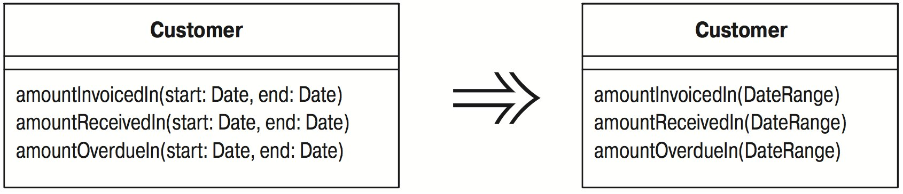

# Введение граничного объекта (Introduce Parameter Object)

Есть группа параметров, естественным образом связанных друг с другом.

_Замените их объектом._



## Мотивировка

Часто встречается некоторая группа параметров, обычно передаваемых вместе. Эта группа может использоваться несколькими методами одного или более классов. Такая группа классов представляет собой группу данных (data clump) и может быть заменена объектом, хранящим все эти данные. Целесообразно свести эти параметры в объект, чтобы сгруппировать данные вместе. Такой рефакторинг полезен, поскольку сокращает размер списков параметров, а в длинных списках параметров трудно разобраться. Определяемые в новом объекте методы доступа делают также код более последовательным, благодаря чему его проще понимать и модифицировать.

Однако получаемая выгода еще существеннее, поскольку после группировки параметров обнаруживается поведение, которое можно переместить в новый класс. Часто в телах методов производятся одинаковые действия со значениями параметров. Перемещая это поведение в новый объект, можно избавиться от значительного объема дублирующегося кода.

## Техника

* Создайте новый класс для представления группы заменяемых параметров. Сделайте этот класс неизменяемым.
* Выполните компиляцию.
* Для этой новой группы данных примените рефакторинг «Добавление параметра» ([Add Parameter](Add-Parameter.md)). Во всех вызовах метода используйте в качестве значения параметра `null`.

_Если точек вызова много, можно сохранить старую сигнатуру и вызывать в ней новый метод. Примените рефакторинг сначала к старому методу. После этого можно изменять вызовы один за другим и в конце убрать старый метод._

* Для каждого параметра в группе данных осуществите его удаление из сигнатуры. Модифицируйте точки вызова и тело метода, чтобы они использовали вместо этого значения нового объекта.
* Выполняйте компиляцию и тестирование после удаления каждого параметра.
* Убрав параметры, поищите поведение, которое можно было бы переместить в новый объект с помощью «Перемещения метода» ([Move Method](Move-Method.md)).

_Это может быть целым методом или его частью. Если поведение составляет часть метода, примените к нему сначала «Выделение метода» ([Extract Method](Extract-Method.md)), а затем переместите новый метод._

## Пример

Начну с бухгалтерского счета и проводок по нему. Проводки представляют собой простые объекты данных.

```java
class Entry...
    Entry (double value, Date chargeDate) {
        _value = value;
        _chargeDate = chargeDate;
    }
    
    Date getDate() {
        return _chargeDate;
    }
    
    double getValue(){
        return _value;
    }
    
    private Date _chargeDate;
    private double _value;            
```

Мое внимание сосредоточено на счете, хранящем коллекцию проводок и предоставляющем метод, определяющий движение по счету в период между двумя датами:

```java
class Account...
    double getFlowBetween (Date start, Date end) {
        double result = 0;
        Enumeration e = _entries.elements();
        while (e.hasMoreElements()) {
            Entry each = (Entry) e.nextElement();
            if (each.getDate().equals(start) || each.getDate().equals(end) ||
                (each.getDate().after(start) && each.getDate().before(end))
            ) {
                result += each.getValue();
            }
        }
        return result;
    }
    
    private Vector _entries = new Vector();

// client code...
    double flow = anAccount.getFlowBetween(startDate, endDate);
```

Не знаю, в который уже раз я сталкиваюсь с парами значений, представляющих диапазон, например, даты начала и конца или верхние и нижние числовые границы. Можно понять, почему это происходит, в конце концов, раньше я сам делал подобные вещи. Но с тех пор как я увидел паттерн диапазона [Fowler, AP], я всегда стараюсь использовать не пары, а диапазоны. Первым делом объявляю простой объект данных для диапазона:

```java
class DateRange {
    DateRange (Date start, Date end) {
        _start = start;
        _end = end;
    }

    Date getStart() {
        return _start;
    }

    Date getEnd() {
        return _end;
    }
    
    private final Date _start;
     
    private final Date _end;
}
```

Я сделал класс диапазона дат неизменяемым; это означает, что все значения для диапазона дат определены как `final` и устанавливаются в конструкторе, поэтому нет методов для модификации значений. Это мудрый шаг для того, чтобы избежать наложения ошибок. Поскольку в Java параметры передаются по значению, придание классу свойства неизменяемости имитирует способ действия параметров Java, поэтому такое допущение правильно для данного рефакторинга.

Затем я добавляю диапазон дат в список параметров метода `getFlowBetween`:

```java
class Account...
    double getFlowBetween (Date start, Date end, DateRange range) {
        double result = 0;
        Enumeration e = _entries.elements();
        while (e.hasMoreElements()) {
            Entry each = (Entry) e.nextElement();
            if (
                each.getDate().equals(start) || each.getDate().equals(end) ||
                (each.getDate().after(start) && each.getDate().before(end))
            ) {
                result += each.getValue();
            }
        }
        
        return result;
     }
     
// client code...
    double flow = anAccount.getFlowBetween(startDate, endDate, null);
```

В этом месте мне надо только выполнить компиляцию, потому что я еще не менял никакого поведения.

Следующим шагом удаляется один из параметров, место которого занимает новый объект. Для этого я удаляю параметр `start` и модифицирую метод и обращения к нему так, чтобы они использовали новый объект:

```java
class Account...
    double getFlowBetween (Date end, DateRange range) {
        double result = 0;
        Enumeration e = _entries.elements();
        while (e.hasMoreElements()) {
            Entry each = (Entry) e.nextElement();
            if (
                each.getDate().equals(range.getStart()) ||
                each.getDate().equals(end) ||
                (each.getDate().after(range.getStart()) &&
                each.getDate().before(end))
            ) {
                result += each.getValue();
            }
        }
        return result;
    }
    
// client code...
double flow = anAccount.getFlowBetween(endDate, new DateRange (startDate, null));
```

После этого я удаляю конечную дату:

```java
class Account...
    double getFlowBetween (DateRange range) {
        double result = 0;
        Enumeration e = _entries.elements();
        while (e.hasMoreElements()) {
            Entry each = (Entry) e.nextElement();
            if(
                each.getDate().equals(range.getStart()) ||
                each.getDate().equals(range.getEnd()) ||
                (each.getDate().after(range.getStart()) &&
                each.getDate().before(range.getEnd()))
            ) {
                result += each.getValue();
            }
        }
        
        return result;
    }

// client code...
double flow = anAccount.getFlowBetween(new DateRange (startDate, endDate));
```

Я ввел граничный объект; однако я могу получить от этого рефакторинга больше пользы, если перемещу в новый объект поведение из других методов. В данном случае я могу взять код в условии, применить к нему «Выделение метода» ([Extract Method](Extract-Method.md)) и «Перемещение метода» ([Move Method](Move-Method.md)) и получить:

```java
class Account...
    double getFlowBetween (DateRange range) {
        double result = 0;
        Enumeration e = _entries.elements();
        while (e.hasMoreElements()) {
            Entry each = (Entry) e.nextElement();
            if (range.includes(each.getDate())) {
                result += each.getValue();
            }
        }
        
        return result;
    }
    
class DateRange...
    boolean includes (Date arg) {
        return (arg.equals(_start) || arg.equals(_end) ||
            (arg.after(_start) && arg.before(_end)));
    }
```

Обычно такие простые выделения и перемещения, как здесь, я выполняю за один шаг. Если возникнет ошибка, можно дать задний ход, после чего модифицировать код за два маленьких шага.