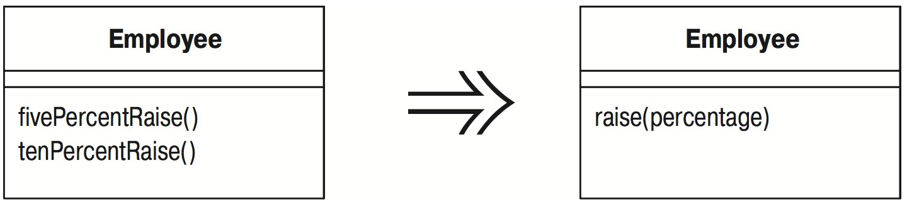

# Параметризация метода (Parameterize Method)

Несколько методов выполняют сходные действия, но с разными значениями, содержащимися в теле метода.

_Создайте один метод, который использует для задания разных значений параметр._



## Мотивировка

Иногда встречаются два метода, выполняющие сходные действия, но отличающиеся несколькими значениями. В этом случае можно упростить положение, заменив разные методы одним, который обрабатывает разные ситуации с помощью параметров. При таком изменении устраняется дублирование кода и возрастает гибкость, потому что в результате добавления параметров можно обрабатывать и другие ситуации.

## Техника

* Создайте параметризованный метод, которым можно заменить каждый повторяющийся метод.
* Выполните компиляцию.
* Замените старый метод вызовом нового.
* Выполните компиляцию и тестирование.
* Повторите для каждого метода, выполняя тестирование после каждой замены.

Иногда это оказывается возможным не для всего метода, а только для его части. В таком случае сначала выделите фрагмент в метод, а затем параметризуйте этот метод.

## Пример

Простейший случай представляют методы, показанные ниже:

```java
class Employee {
    void tenPercentRaise () {
        salary *= 1.1;
    }
    
    void fivePercentRaise () {
        salary *= 1.05;
    }
```

Их можно заменить следующим:

```java
void raise (double factor) {
    salary *= (1 + factor);
}
```

Конечно, этот случай настолько прост, что его заметит каждый.

Вот менее очевидный случай:

```java
protected Dollars baseCharge() {
    double result = Math.min(lastUsage(),100) * 0.03;
    if (lastUsage() > 100) {
        result += (Math.min (lastUsage(),200) - 100) * 0.05;
    }
    if (lastUsage() > 200) {
        result += (lastUsage() - 200) * 0.07;
    }
    
    return new Dollars (result);
}
```

Этот код можно заменить таким:

```java
protected Dollars baseCharge() {
    double result = usageInRange(0, 100) * 0.03;
    result += usageInRange (100,200) * 0.05;
    result += usageInRange (200, Integer.MAX_VALUE) * 0.07;
    return new Dollars (result);
}

protected int usageInRange(int start, int end) {
    if (lastUsage() > start) return Math.min(lastUsage(),end) - start;
    else return 0;
}
```

Сложность в том, чтобы обнаружить повторяющийся код, использующий несколько значений, которые можно передать в качестве параметров.
