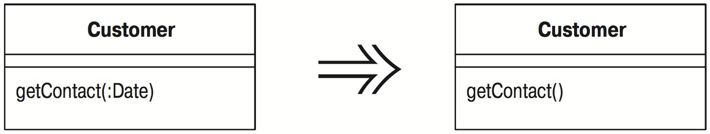

# Удаление параметра (Remove Parameter)

Параметр более не используется в теле метода.

_Удалите его._

## Мотивировка

Программисты часто добавляют параметры и неохотно их удаляют. В конце концов, ложный параметр не вызывает никаких проблем, а в будущем может снова понадобиться.

Это нашептывает демон темноты и неясности; изгоните его из своей души! Параметр указывает на необходимую информацию; различие значений играет роль. Тот, кто вызывает ваш метод, должен озаботиться передачей правильных значений. Не удалив параметр, вы создаете лишнюю работу для всех, кто использует метод. Это нехороший компромисс, тем более что удаление параметров представляет собою простой рефакторинг.

Осторожность здесь нужно проявлять, когда метод является полиморфным. В этом случае может оказаться, что данный параметр используется в других реализациях этого метода, и тогда его не следует удалять. Можно добавить отдельный метод для использования в таких случаях, но нужно исследовать, как пользуются этим методом вызывающие, чтобы решить, стоит ли это делать. Если вызывающим известно, что они имеют дело с некоторым подклассом и выполняют дополнительные действия для поиска параметра либо пользуются информацией об иерархии классов, чтобы узнать, можно ли обойтись значением `null`, добавьте еще один метод без параметра. Если им не требуется знать о том, какой метод какому классу принадлежит, следует оставить вызывающих в счастливом неведении.

## Техника

Техника «Удаления параметра» ([Remove Parameter](Remove-Parameter.md)) очень похожа на «Переименование метода» ([Rename Method](Rename-Method.md)) и «Добавление параметра» ([Add Parameter](Add-Parameter.md)).

* Выясните, реализуется ли сигнатура метода в родительском классе или подклассе. Выясните, используют ли класс или родительский класс этот параметр. Если да, не производите этот рефакторинг.
* Объявите новый метод без параметра. Скопируйте тело прежнего метода в метод с новым именем и осуществите необходимую подгонку.

_Если требуется удалить несколько параметров, проще удалить их все сразу._

* Выполните компиляцию.
* Измените тело старого метода так, чтобы в нем вызывался новый метод.

_Если ссылок на метод немного, вполне можно пропустить этот шаг._

* Выполните компиляцию и тестирование.
* Найдите все ссылки на прежний метод и замените их ссылками на новый. Выполняйте компиляцию и тестирование после каждой замены.
* Удалите старый метод.

_Если старый метод является частью интерфейса и его нельзя удалить, сохраните его и пометьте как устаревший (deprecated)._

* Выполните компиляцию и тестирование.

Поскольку я чувствую себя вполне уверенно при добавлении и удалении параметров, я часто делаю это сразу для группы за один шаг.