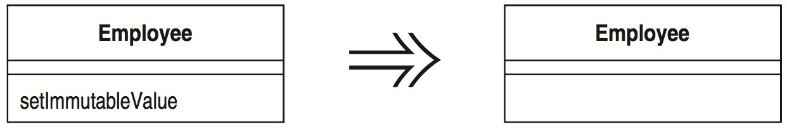

# Удаление метода установки значения (Remove Setting Method)

Поле должно быть установлено в момент создания и больше никогда не изменяться.

_Удалите методы, устанавливающие значение этого поля._



## Мотивировка

Предоставление метода установки значения показывает, что поле может изменяться. Если вы не хотите, чтобы поле менялось после создания объекта, то не предоставляйте метод установки (и объявите поле с ключевым словом `final`). Благодаря этому ваш замысел становится ясен и часто устраняется всякая возможность изменения поля.

Такая ситуация часто имеет место, когда программисты слепо пользуются косвенным доступом к переменным [Beck]. Такие программисты применяют затем методы установки даже в конструкторе. Думаю, что это может объясняться стремлением к последовательности, но путаница, которую метод установки вызовет впоследствии, не идет с этим ни в какое сравнение.

## Техника

* Если поле не объявлено как `final`, сделайте это.
* Выполните компиляцию и тестирование.
* Проверьте, чтобы метод установки вызывался только в конструкторе или методе, вызываемом конструктором.
* Модифицируйте конструктор или вызываемый им метод, чтобы он непосредственно обращался к переменным.

_Это не удастся сделать, если есть подкласс, устанавливающий закрытые поля родительского класса. В таком случае надо попытаться предоставить защищенный метод родительского класса (в идеале – конструктор), устанавливающий эти значения. Как бы вы ни поступили, не давайте методу родительского класса имя, по которому его можно было бы принять за метод установки значения._

* Выполните компиляцию и тестирование.
* Удалите метод установки.
* Выполните компиляцию.

## Пример

Вот простой пример:

```java
class Account {
    private String _id;
    Account (String id) {
        setId(id);
    }
    
    void setId (String arg) {
        _id = arg;
    }
```

Этот код можно заменить следующим:

```java
class Account {
    private final String _id;
    Account (String id) {
        _id = id;
    }
```

Возникают проблемы нескольких видов. Первый случай – выполнение вычислений над аргументом:

```java
class Account {
    private String _id;
    
    Account (String id) {
        setId(id);
    }
    void setId (String arg) {
        _id = "ZZ" + arg;
    }
```

Если изменение простое (как здесь) и конструктор только один, можно внести изменения в конструктор. Если изменение сложное или необходимо выполнять вызов из различных методов, я должен создать метод. В этом случае надо присвоить методу имя, делающее ясным его назначение:

```java
class Account {
    private final String _id;
    
    Account (String id) {
        initializeId(id);
    }
    void initializeId (String arg) {
        _id = "ZZ" + arg;
    }
```

Неприятный случай возникает, когда есть подклассы, инициализирующие закрытые переменные родительского класса:

```java
class InterestAccount extends Account...
    private double _interestRate;
    
    InterestAccount (String id, double rate) {
        setId(id);
        _interestRate = rate;
    }
```

Проблема в том, что нельзя непосредственно обратиться к `id`, чтобы присвоить ему значение. Самым лучшим решением будет использовать конструктор родительского класса:

```java
class InterestAccount...
    InterestAccount (String id, double rate) {
        super(id);
        _interestRate = rate;
    }
```

Если это невозможно, то лучше воспользоваться методом с хорошим названием:

```java
class InterestAccount...
    InterestAccount (String id, double rate) {
        initializeId(id);
        _interestRate = rate;
    }
```

Следует также рассмотреть случай присвоения значения коллекции:

```java
class Person {
    Vector getCourses() {
        return _courses;
    }
    
    void setCourses(Vector arg) {
        _courses = arg;
    }

    private Vector _courses;
```

Здесь я хочу заменить метод установки операциями добавления и удаления. Это описывается в «Инкапсуляции коллекции» ([Encapsulate Collection](Encapsulate-Collection.md)).