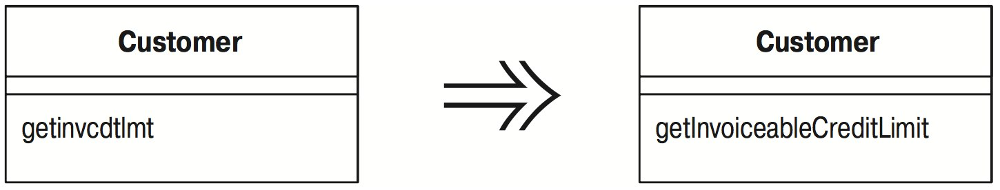

# Переименование метода (Rename Method)

Имя метода не раскрывает его назначения.

_Измените имя метода._



## Мотивировка

Важной частью пропагандируемого мной стиля программирования является разложение сложных процедур на небольшие методы. Если делать это неправильно, то придется изрядно помучиться, выясняя, что же делают эти маленькие методы. Избежать таких мучений помогает назначение методам хороших имен. Методам следует давать имена, раскрывающие их назначение. Хороший способ для этого – представить себе, каким должен быть комментарий к методу, и преобразовать этот комментарий в имя метода.

Жизнь такова, что удачное имя может не сразу придти в голову. В подобной ситуации может возникнуть соблазн бросить это занятие – в конце концов, не в имени счастье. Это вас соблазняет бес, не слушайте его. Если вы видите, что у метода плохое имя, обязательно измените его. Помните, что ваш код в первую очередь предназначен человеку, и только потом – компьютеру. Человеку нужны хорошие имена. Вспомните, сколько времени вы потратили, пытаясь что то сделать, и насколько проще было бы, окажись у пары методов более удачные имена. Создание хороших имен – это мастерство, требующее практики; совершенствование этого мастерства – ключ к превращению в действительно искусного программиста. То же справедливо и в отношении других элементов сигнатуры метода. Если переупорядочение параметров проясняет суть, выполните его (см. «Добавление параметра» ([Add Parameter](Add-Parameter.md)) и «Удаление параметра» ([Remove Parameter](Remove-Parameter.md))).

## Техника

* Выясните, где реализуется сигнатура метода – в родительском классе или подклассе. Выполните эти шаги для каждой из реализаций.
* Объявите новый метод с новым именем. Скопируйте тело прежнего метода в метод с новым именем и осуществите необходимую подгонку.
* Выполните компиляцию.
* Измените тело прежнего метода так, чтобы в нем вызывался новый метод.

_Если ссылок на метод немного, вполне можно пропустить этот шаг._

* Выполните компиляцию и тестирование.
* Найдите все ссылки на прежний метод и замените их ссылками на новый. Выполняйте компиляцию и тестирование после каждой замены.
* Удалите старый метод.

_Если старый метод является частью интерфейса и его нельзя удалить, сохраните его и пометьте как устаревший (deprecated)._

* Выполните компиляцию и тестирование.

## Пример

Имеется метод для получения номера телефона лица:

```java
public String getTelephoneNumber() {
    return ("(" + _officeAreaCode + ") " + _officeNumber);
}
```

Я хочу переименовать метод в `getOfficeTelephoneNumber`. Начинаю с создания нового метода и копирования тела в новый метод. Старый метод изменяется так, чтобы вызывать новый:

```java
class Person...
    public String getTelephoneNumber(){
        return getOfficeTelephoneNumber();
    }
    public String getOfficeTelephoneNumber() {
        return ("(" + _officeAreaCode + ") " + _officeNumber);
    }
```

Теперь я нахожу места вызова прежнего метода и изменяю их так, чтобы в них вызывался новый метод. После всех изменений прежний метод можно удалить.

Такая же процедура осуществляется, когда нужно добавить или удалить параметр.

Если мест, из которых вызывается метод, немного, я изменяю их для обращения к новому методу без использования прежнего метода в качестве делегирующего. Если в результате тесты «захромают», я вернусь назад и произведу изменения без лишней поспешности.
