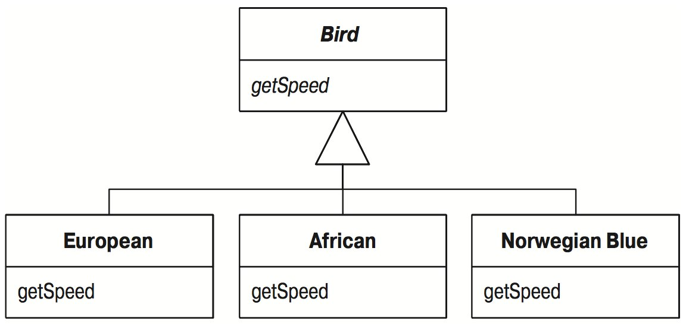
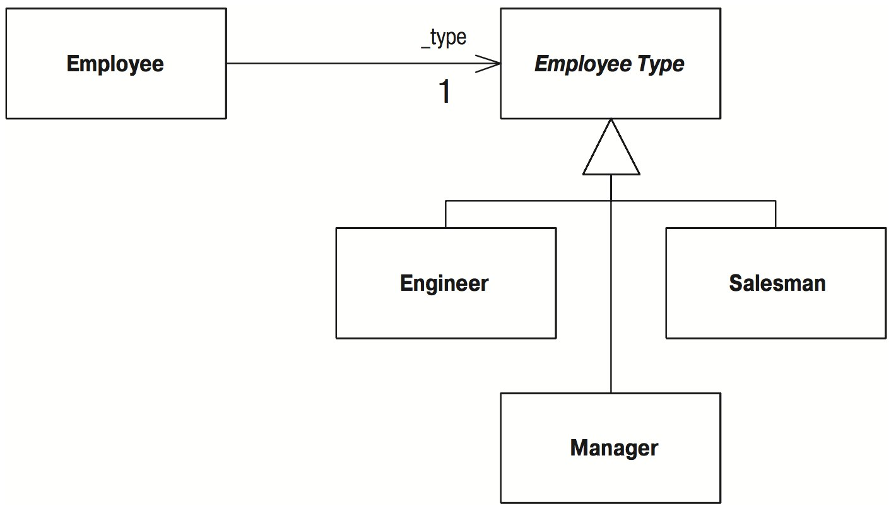

# Замена условного оператора полиморфизмом (Replace Conditional with Polymorphism)

Есть условный оператор, поведение которого зависит от типа объекта.

_Переместите каждую ветвь условного оператора в перегруженный метод подкласса. Сделайте исходный метод абстрактным._

```java
double getSpeed() {
    switch (_type) {
        case EUROPEAN:
            return getBaseSpeed();
        case AFRICAN:
            return getBaseSpeed() - getLoadFactor() * _numberOfCoconuts;
        case NORWEGIAN_BLUE:
            return (_isNailed) ? 0 : getBaseSpeed(_voltage);
    }
    throw new RuntimeException ("Should be unreachable");
}
```




## Мотивировка

Одним из наиболее внушительно звучащих слов из жаргона объектного программирования является _полиморфизм_. Сущность полиморфизма состоит в том, что он позволяет избежать написания явных условных операторов, когда есть объекты, поведение которых различно в зависимости от их типа.

В результате оказывается, что операторы `switch`, выполняющие переключение в зависимости от кода типа, или операторы `if-then-else`, выполняющие переключение в зависимости от строки типа, в объектноориентированных программах встречаются значительно реже.

Полиморфизм дает многие преимущества. Наибольшая отдача имеет место тогда, когда один и тот же набор условий появляется во многих местах программы. Если необходимо ввести новый тип, то приходится отыскивать и изменять все условные операторы. Но при использовании подклассов достаточно создать новый подкласс и обеспечить в нем соответствующие методы. Клиентам класса не надо знать о подклассах, благодаря чему сокращается количество зависимостей в системе и упрощается ее модификация.

## Техника

Прежде чем применять «Замену условного оператора полиморфизмом» ([Replace Conditional with Polymorphism](/Replace-Conditional-with-Polymorphism.md)), следует создать необходимую иерархию наследования. Такая иерархия может уже иметься как результат ранее проведенного рефакторинга. Если этой иерархии нет, ее надо создать.

Создать иерархию наследования можно двумя способами: «Заменой кода типа подклассами» ([Replace Type Code with Subclasses](/Replace-Type-Code-with-Subclasses.md)) и «Заменой кода типа состоянием/стратегией» ([Replace Type Code with State/Strategy](/Replace-Type-Code-with-State-Strategy.md)). Более простым вариантом является создание подклассов, поэтому по возможности следует выбирать его. Однако если код типа изменяется после того, как создан объект, применять создание подклассов нельзя, и необходимо применять паттерн «состояния/стратегии». Паттерн «состояния/стратегии» должен использоваться и тогда, когда подклассы данного класса уже создаются по другим причинам. Помните, что если несколько операторов `case` выполняют переключение по одному и тому же коду типа, для этого кода типа нужно создать лишь одну иерархию наследования.

Теперь можно предпринять атаку на условный оператор. Код, на который вы нацелились, может быть оператором `switch` (`case`) или оператором `if`.

* Если условный оператор является частью более крупного метода, разделите условный оператор на части и примените «Выделение метода» ([Extract Method](/Extract-Method.md)).
* При необходимости воспользуйтесь перемещением метода, чтобы поместить условный оператор в вершину иерархии наследования.
* Выберите один из подклассов. Создайте метод подкласса, перегружающий метод условного оператора. Скопируйте тело этой ветви условного оператора в метод подкласса и настройте его по месту.

_Для этого может потребоваться сделать некоторые закрытые члены надкласса защищенными._

* Выполните компиляцию и тестирование.
* Удалите скопированную ветвь из условного оператора.
* Выполните компиляцию и тестирование.
* Повторяйте эти действия с каждой ветвью условного оператора, пока все они не будут превращены в методы подкласса.
* Сделайте метод родительского класса абстрактным.

## Пример

Я обращусь к скучному и упрощенному примеру расчета зарплаты служащих. Применяются классы, полученные после «Замены кода типа состоянием/стратегией» ([Replace Type Code with State/Strategy](Replace-Type-Code-with-State-Strategy.md)), поэтому объекты выглядят так, как показано на рис.



```java
class Employee...
    int payAmount() {
        switch (getType()) {
            case EmployeeType.ENGINEER:
                return _monthlySalary;
            case EmployeeType.SALESMAN:
                return _monthlySalary + _commission;
            case EmployeeType.MANAGER:
                return _monthlySalary + _bonus;
            default:
                throw new RuntimeException("Incorrect Employee");
        }
    }
    
    int getType() {
        return _type.getTypeCode();
    }
    
    private EmployeeType _type;
    
abstract class EmployeeType...
    abstract int getTypeCode();
    
class Engineer extends EmployeeType...
    int getTypeCode() {
        return Employee.ENGINEER;
    }
    
    // ... и другие подклассы
```

Оператор `case` уже должным образом выделен, поэтому с этим делать ничего не надо. Что надо, так это переместить его в `EmployeeType`, поскольку это тот класс, для которого создаются подклассы.

```java
class EmployeeType...
    int payAmount(Employee emp) {
        switch (getTypeCode()) {
            case ENGINEER:
                return emp.getMonthlySalary();
            case SALESMAN:
                return emp.getMonthlySalary() + emp.getCommission();
            case MANAGER:
                return emp.getMonthlySalary() + emp.getBonus();
            default:
                throw new RuntimeException("Incorrect Employee");
        }
    }

``` 

Так как мне нужны данные из `Еmployee`, я должен передать его в качестве аргумента. Некоторые из этих данных можно переместить в объект типа `Еmployee`, но это тема другого рефакторинга.

Если компиляция проходит успешно, я изменяю метод `payAmount` в классе `Еmployee`, чтобы он делегировал обработку новому классу:

```java
class Employee...
    int payAmount() {
        return _type.payAmount(this);
    }
```

Теперь можно заняться оператором `case`. Это будет похоже на расправу мальчишек с насекомыми – я буду отрывать ему «ноги» одну за другой. Сначала я скопирую ветвь `Engineer` оператора case в класс `Engineer`

```java
class Engineer...
    int payAmount(Employee emp) {
        return emp.getMonthlySalary();
    }
```

Этот новый метод замещает весь оператор `case` для инженеров. Поскольку я параноик, то иногда ставлю ловушку в операторе `case`:

```java
class EmployeeType...
    int payAmount(Employee emp) {
        switch (getTypeCode()) {
            case ENGINEER:
                throw new RuntimeException ("Должна происходить перегрузка");
            case SALESMAN:
                return emp.getMonthlySalary() + emp.getCommission();
            case MANAGER:
                return emp.getMonthlySalary() + emp.getBonus();
            default:
                throw new RuntimeException("Incorrect Employee");
        }
    }
```

Продолжаем выполнение, пока не будут удалены все «ноги» (ветви):

```java
class Salesman...
    int payAmount(Employee emp) {
        return emp.getMonthlySalary() + emp.getCommission();
    }
    
class Manager...
    int payAmount(Employee emp) {
        return emp.getMonthlySalary() + emp.getBonus();
    }
    
// А теперь делаем метод родительского класса абстрактным:
          
class EmployeeType...
    abstract int payAmount(Employee emp);
```